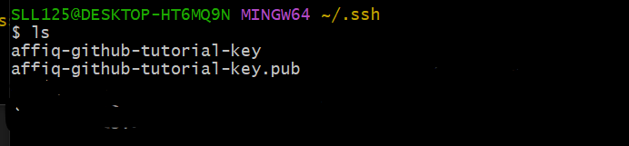
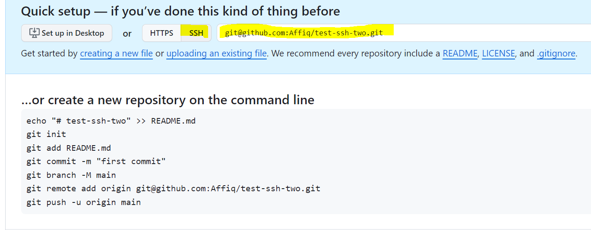

# SSH - Pushing to GitHub

## Creating Key-Pair

We will first need to navigate to our .ssh folder to generate our key-pair. We will use the following command:
```ssh-keygen -t rsa -b 4096 -C "email"```
* Where ```-t rsa``` specifies to use the RSA algorithm
* ```-b 4096``` specifies the bytes to use for the keys
* ```-C "email"``` specifies the owner of the key.

It will then prompt you for the name of a key file, and a passphrase for the key (which you can optionally leave blank).

This should then create two new files, one key and one .pub file (which are private and public respectively)



## Registering keys on GitHub
We will then need to go to GitHub and navigate to ```Settings > Access > SSH & GPG Keys```.
We will then need to click on ```New SSH Key```.

We will then have to navigate back to our Git Bash terminal and verify if our SSH agent is running.
```
eval `ssh-agent -s`
```
This should give some output such as 
```
Agent pid <some-number>
```

We will then need to use ```cat <key-name>.pub``` to print the output of our public key, and copy and paste the contents into GitHub's Key input field. The title given can be arbritary before finally adding our SSH key.

## Adding private key to Registry
We will use the command ```ssh-add <key-name>``` to add our private key to our registry. From within the same folder, we can then verify the connection using the command ```ssh -T git@github.com``` from within the same folder. You should get a response along the lines of 
```
Hi Affiq! You've successfully authenticated, but GitHub does not provide shell access.
```

## Create a Test Repo
Create a test repo. However, when establishing the first connection, simply change the option to SSH instead of HTTPS to obtain the commands needed to use SSH. 



Follow the instructions needed to push an update to your first repo, and everything should function accordingly. Verify through GitHub's website inside your repo to check if the readme has been uploaded.

```
echo "# test-ssh-two" >> README.md
git init
git add README.md
git commit -m "first commit"
git branch -M main
git remote add origin git@github.com:Affiq/test-ssh-two.git
git push -u origin main
```